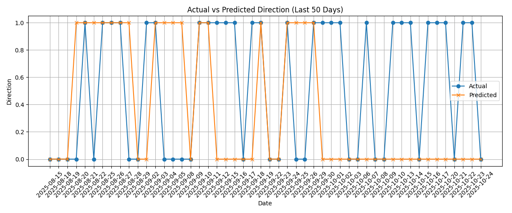

# FusionLite Insight – Financial ML Pipeline

This project simulates a miniature version of **J.P. Morgan’s Fusion platform**, focusing on the **end-to-end application of machine learning** on financial time series data.

It was built in one day to demonstrate hands-on skills in applied ML, data validation, analytics, and pipeline design.

---

## 📌 Features

- 🔄 **Data Ingestion**: Downloads daily stock price data from Yahoo Finance using `yfinance`
- ✅ **Validation & Cleaning**: Checks for missing values, enforces schema rules, and standardizes data
- 📊 **Feature Engineering**: Adds financial indicators such as:
  - Daily returns
  - Moving averages
  - Rolling volatility
- 🧠 **Machine Learning**: Trains a **Random Forest classifier** to predict **next-day price direction**
- 📈 **Visualization**: Compares predicted vs actual price movement using Matplotlib
- 🧪 **Modular Python Scripts**: Clean, testable, and extendable code design

---

## 🧠 Why This Project?

> This was built as a skill demonstration for roles like **Applied AI/ML Associate** at **J.P. Morgan** — especially to align with:
> - Fusion’s data platform goals
> - ML pipelines on real-world financial data
> - Scalable, maintainable engineering practices

---

## 🛠️ Tech Stack

- Python 3.10+
- `yfinance`, `pandas`, `scikit-learn`, `matplotlib`

---

## 🚀 How to Run It

> Create a virtual environment and install dependencies:

```bash
python -m venv .venv
source .venv/bin/activate      # or .venv\Scripts\activate on Windows
pip install -r requirements.txt

## Then Run the full pipeline step by step
python fetch_data.py        # Step 1: Download stock data
python validate_data.py     # Step 2: Clean + validate
python features.py          # Step 3: Feature engineering
python train_model.py       # Step 4: Train + evaluate model
python visualize.py         # Step 5: Plot insights

```
##Sample Output

Accuracy Report:
Accuracy: 0.65
Precision / Recall / F1 Score shown per class

Prediction Plot:
A 50-day plot of actual vs predicted price directions.

## Viualising Results

This plot shows how well the model predicted the binary direction (up/down) of the stock price.



*Figure: Model predictions vs actual price direction over the last 50 days.*

📬 Author

Sujeeth Viswanathan

License

Apache 2.0
